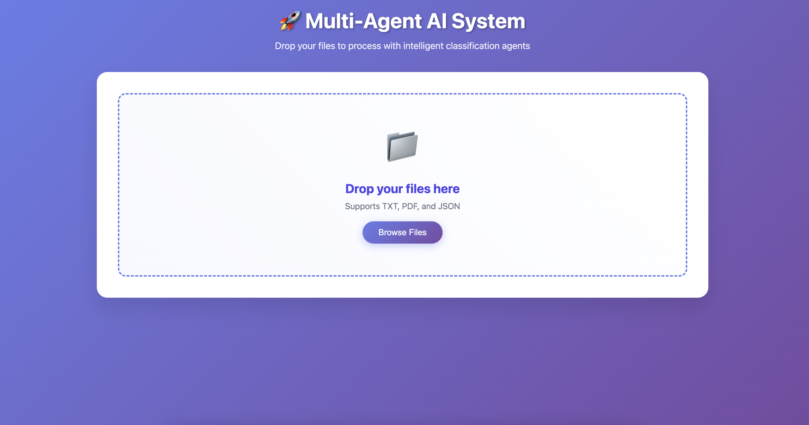

# Multi-Agentic Architecture

A sophisticated multi-agent AI system that intelligently processes various input formats (PDF, JSON, Email) by classifying content and routing it to specialized agents for optimal handling.

## 🚀 Quick Start

### How to Run

1. **Configure API Credentials**
   ```bash
   # Put a gemini.env file in the creds folder with:
   GOOGLE_API_KEY="your_api_key_here"
   ```

2. **Set Up Environment**
   ```bash
   python3 -m venv .env
   source .env/bin/activate  # On Windows: .env\Scripts\activate
   ```

3. **Install Dependencies**
   ```bash
   python3 -m pip install -r requirements.txt
   ```

4. **Launch the Application**
   ```bash
   python3 server.py
   ```

5. **Access the Interface**
   - A frontend will appear that allows you to upload files you want to process
   - Use that interface to interact with the agent flow



## 🎯 Problem Statement

Build a multi-agent AI system that accepts input in PDF, JSON, or Email (text) format, classifies the format and intent, and routes it to the appropriate agent. The system must maintain shared context (e.g., sender, topic, last extracted fields) to enable chaining and traceability.

## 🏗️ System Architecture

The system consists of 3 specialized agents orchestrated by a central Classifier Agent:

### 1. Classifier Agent
- **Input**: Raw file/email/JSON content
- **Functions**:
  - Classifies format (PDF / JSON / Email)
  - Determines intent (Invoice, RFQ, Complaint, Regulation, etc.)
  - Routes content to the appropriate specialized agent
  - Logs format and intent information in shared memory

### 2. JSON Agent
- **Purpose**: Handles structured JSON payloads
- **Capabilities**:
  - Extracts and reformats data to target schema
  - Validates data integrity
  - Flags anomalies or missing required fields
  - Ensures compliance with expected data structures

### 3. Email Agent
- **Purpose**: Processes email content
- **Capabilities**:
  - Extracts sender information and metadata
  - Determines intent and urgency levels
  - Formats output for CRM-style integration
  - Handles conversational context and threading

## 💾 Shared Memory Module

A lightweight, centralized memory system that stores:
- **Source Information**: Origin, type, timestamp
- **Extracted Values**: Key data points from processing
- **Thread Management**: Conversation or interaction IDs
- **Traceability**: Complete processing history

**Storage Options**: Redis, SQLite, or in-memory storage for cross-agent accessibility.

## 🔄 Example Workflow

```
User Input (Email) → Classifier Agent → Detects "Email + RFQ" 
                                    ↓
                          Routes to Email Agent → Extracts Information 
                                    ↓
                          Memory Module ← Logs Results
```

## 🛠️ Tech Stack

- **Language**: Python
- **AI/ML**: Large Language Models (OpenAI/Gemini or open-source alternatives)
- **Memory Storage**: Redis / SQLite / JSON store
- **Frontend**: Web-based file upload interface
- **Processing**: Multi-format document handling

## 📁 Project Structure

```
flowbit-project-demo/
├── agents/
│   ├── classifier_agent.py   # Main routing and classification logic
│   ├── email_agent.py        # Email content handler
│   └── json_agent.py         # JSON processing specialist
├── assets/                    # Static assets
├── creds/
│   └── gemini.env            # API credentials (create this)
├── input_samples/
│   ├── extra_samples/        # Additional test files
│   ├── sample.json          # Sample JSON input
│   ├── sample.pdf           # Sample PDF input
│   └── sample.txt           # Sample text/email input
├── templates/
│   └── index.html           # Frontend template
├── uploads/                  # File upload directory
├── utils/
│   ├── shared_memory.py       # Cross-agent memory management
│   └── file_loader.py       # File handling utilities
├── .gitignore              # Git ignore rules
├── main.py                 # Main application entry point
├── README.md               # This file
├── requirements.txt        # Python dependencies
└── server.py              # Web server
```

## 🚀 Prerequisites

- Python 3.7+
- Virtual environment support
- API access to Gemini (Google AI)

## 🔧 Usage

1. **Start the Server**: Run `python3 server.py`
2. **Upload Content**: Use the web interface to upload files
3. **Automatic Processing**: The system will:
   - Classify your input format and intent
   - Route to the appropriate specialist agent
   - Process and extract relevant information
   - Store results in shared memory for traceability

## 🎯 Supported Formats & Intents

### Input Formats
- **PDF**: Document files, invoices, reports
- **JSON**: Structured data payloads
- **Email**: Text-based email content

### Intent Classification
- Invoice processing
- Request for Quotation (RFQ)
- Customer complaints
- Regulatory documents
- General inquiries
- And more...

**Built with ❤️ using Python and AI**